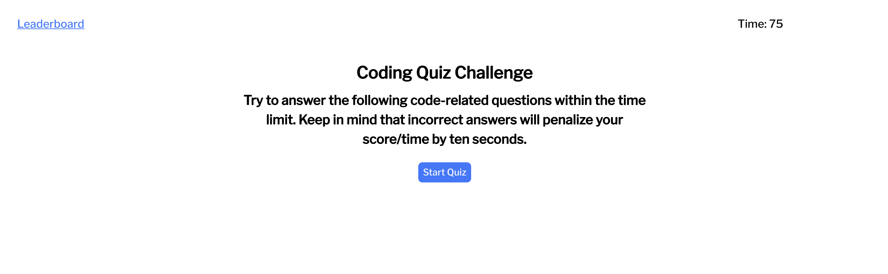
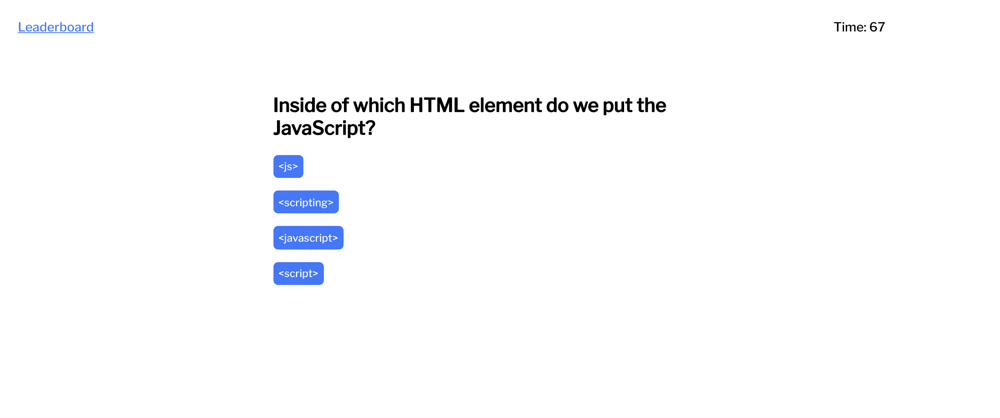

# code-quiz
This is a code quiz that asks five basic questions about JavaScript and records the time when the quiz ends as the user's score.

Answering incorrectly subtracts ten seconds from the time remaining.

Once finished, user's can enter their initials to be recording with their score on the leaderboard. The leaderboard entries are stored in local storage so the user can play multiple times and still see previously recorded results.

Please view the deployed project [here](https://nicholasrokosz.github.io/code-quiz/).

---

---

---

---
